# platform-setup

Claude Code plugin for conversationally provisioning Alvera platform
resources via [`@alvera-ai/platform-sdk`](https://www.npmjs.com/package/@alvera-ai/platform-sdk).

## Skills

Four skills. `guided` handles the general resource loop; the other
three form a focused chain for onboarding a new dataset end-to-end —
each is also independently invokable.

```
/custom-dataset-creation  →  /DAC-upload  →  /query-datasets
    (define schema)         (push a file)    (verify rows land)
```

### Dataset-chain user flow

```mermaid
flowchart LR
    subgraph cdc ["/custom-dataset-creation"]
        direction TB
        start1([user invokes]) --> gate{compliance gate<br/>dummy · shareable · regulated?}
        gate -->|dummy / shareable| inline[Claude reads file<br/>inline profiling]
        gate -->|regulated| script[Write ./alvera-profile.py<br/>user runs locally<br/>only schema returns]
        inline --> prop[Column proposal<br/>· type · required · unique<br/>· privacy_requirement <b>locked</b><br/>· is_unique = <b>composite</b>]
        script --> prop
        prop --> confirm[/Proceed? y/n/]
        confirm --> create[alvera generic-tables create<br/>--body-file tmpfile chmod 600<br/>append infra.yaml]
    end

    subgraph dac ["/DAC-upload"]
        direction TB
        start2([user invokes]) --> elicit1[DAC slug · file path<br/>· optional tenant]
        elicit1 --> link[alvera data-activation-clients<br/>upload-link<br/>→ presigned url + key]
        link --> put[curl -X PUT<br/>Content-Type must match<br/>--upload-file → presigned url]
        put --> ingest[alvera data-activation-clients<br/>ingest-file &lt;slug&gt; &lt;key&gt;<br/>→ batch_id · jobs_count]
    end

    subgraph qd ["/query-datasets"]
        direction TB
        start3([user invokes]) --> mode{mode?<br/>chat · scaffold}
        mode -->|"(a) chat<br/>data OK to see"| chat[curl to PostgREST<br/>via chmod 600 header tempfile<br/>trap rm on EXIT/INT/TERM]
        chat --> render[Markdown table in chat<br/>cap 50 rows<br/>JWT never echoed]
        mode -->|"(b) scaffold<br/>regulated or iterative"| elicit2[PostgREST url · schema<br/>· JWT <b>secret</b> · table]
        elicit2 --> scaffold[Scaffold ./&lt;table&gt;-explorer/<br/>.gitignore first<br/>.env.local chmod 600<br/>Vite + React single-file app]
        scaffold --> handoff[/npm install && npm run dev<br/>filter input → PostgREST<br/>results table/]
    end

    create -. optional next .-> start2
    ingest -. optional next .-> start3

    classDef entry fill:#eef,stroke:#338,stroke-width:2px
    classDef secret fill:#fee,stroke:#c33,stroke-width:1px
    class start1,start2,start3 entry
    class script,put,chat,elicit2,scaffold secret
```



Dashed arrows = the user decides whether to chain. Red-bordered
nodes touch sensitive material (regulated file content, presigned
auth URL, JWT) — the skills keep those inputs out of the
conversation and off disk wherever possible.

### `guided` — `/platform-setup:guided`

Conversationally provision datalakes, data sources, tools, action status
updaters, AI agents, and connected apps for a tenant. The skill:

- Asks the user for credentials and target datalake once, up front.
- Offers to create a datalake if the tenant has none (DB creds handled
  via env vars or a scaffolded `.alvera.datalake.env` — never inlined).
- Elicits resource fields conversationally — no YAML input required.
- Validates structural rules client-side; enums / cross-field rules go
  to the API as the source of truth.
- Lists existing resources before creating to detect collisions.
- Confirms destructive operations explicitly.
- Emits an `infra.yaml` receipt as it goes (opt-in at start).
- Refuses out-of-scope operations (tenant create, runtime ops, etc.).

Generic-table (custom dataset) creation is **not** here — it lives in
`custom-dataset-creation` because the flow needs a compliance gate and
column profiling that don't fit the generic resource loop.

See [`skills/guided/SKILL.md`](./skills/guided/SKILL.md) for the full
behavior contract.

### `custom-dataset-creation` — `/platform-setup:custom-dataset-creation`

Onboard a custom dataset (generic table) from a CSV or NDJSON sample
file.

- **Compliance gate**: one question, three choices — dummy / shareable
  real / regulated (PHI, PII, BAA-covered). Regulated data is profiled
  by a generated stdlib-only Python script on the user's machine; row
  values never reach the model.
- **Column profiling**: inferred types, null rates, cardinality
  buckets, sensitivity hints, snake_case name normalisation.
- **Schema proposal** with the locked-at-creation `privacy_requirement`
  warning and the composite-key semantics of `is_unique`.
- Creates the table via `alvera generic-tables create` and appends to
  `infra.yaml`. Stops there — hands off to `/DAC-upload` for ingestion
  and `/query-datasets` for verification.

Assumes an `alvera` session + target datalake are already set up — run
`/guided` first if not.

See [`skills/custom-dataset-creation/SKILL.md`](./skills/custom-dataset-creation/SKILL.md).

### `DAC-upload` — `/platform-setup:DAC-upload`

Push a file into a data-activation-client. Three steps:

1. `alvera data-activation-clients upload-link` → presigned PUT URL
2. `curl -X PUT` to stream the file to object storage
3. `alvera data-activation-clients ingest-file` → trigger processing

Supports CSV and NDJSON — the only formats the API accepts. The user
supplies the DAC slug (DAC CRUD isn't on the public API; the slug
comes from the Alvera admin UI). One file per invocation.

See [`skills/DAC-upload/SKILL.md`](./skills/DAC-upload/SKILL.md).

### `query-datasets` — `/platform-setup:query-datasets`

Query a PostgREST-fronted datalake, with **two modes** picked at
invocation:

- **(a) Chat mode** — skill runs one `curl` against PostgREST and
  renders the result as a markdown table directly in the conversation.
  Good for spot-checks of dummy / shareable data. Picking this mode is
  an implicit compliance opt-in: "these rows are OK for the model to
  see." JWT goes into a chmod-600 header tempfile under `/tmp/`,
  consumed by `curl -H @file`, `rm`'d via `trap` on any exit.
- **(b) Scaffold mode** — writes a throwaway Vite + React app at
  `./<table>-explorer/` in the user's cwd. Single-file UI: filter
  input + results table. JWT lives in `.env.local` (chmod 600,
  gitignored), never in source. Pick this for regulated data, or
  when iterative poking is the point.

Purpose either way: row-level verification after data activation, or
ad-hoc querying. Not a BI tool.

See [`skills/query-datasets/SKILL.md`](./skills/query-datasets/SKILL.md).

## Install

```
/plugin marketplace add alvera-ai/alvera-agent
/plugin install platform-setup@alvera-agent
```
