# platform-setup

Claude Code plugin for conversationally provisioning Alvera platform
resources via [`@alvera-ai/platform-sdk@0.7.2`](https://www.npmjs.com/package/@alvera-ai/platform-sdk)
(pinned exact, see "SDK pin" below).

## Skills

Eight skills, two layers:

```
DOMAIN ORCHESTRATORS                RESOURCE WORKHORSES
(walk _order.json sequences,        (each independently invokable;
 delegate to workhorses)             also called BY orchestrators)

  /healthcare                          /guided
  /accounts-receivable  (stub)         /custom-dataset-creation
  /payment-risk         (stub)         /DAC-upload
                                       /agentic-workflow-creation
                                       /query-datasets
```

Domain skills mirror `tests/<domain>/_order.json` from
`@alvera-ai/platform-sdk@0.7.2` — the integration-tests suite is the
**executable contract**; domain skills are the **conversational driver**
that walks the same sequence with user-supplied data.

The five resource workhorses below remain independently invokable for
ad-hoc / out-of-sequence work.

## SDK pin

This plugin pins to **`@alvera-ai/platform-sdk@0.7.2`** exactly. The pin
is asymmetric vs the platform repo: platform tracks SDK `main` (so it
surfaces SDK regressions first), and this plugin pins to a tag (so a
domain walk you ship to a customer is byte-for-byte reproducible). When
the SDK cuts a new tag worth pinning to, bump every domain SKILL.md +
this README in one PR.

## Domain skills

### `healthcare` — `/platform-setup:healthcare`

End-to-end provisioning of a healthcare host on Alvera, walking the
canonical 11-phase setup defined by `tests/healthcare/_order.json` at
the pinned SDK tag. Each phase delegates to a primitive skill and ends
with a `pnpm test:healthcare -- <phase>` verification pointer back at
the corresponding integration-tests spec, so the conversational setup
and the automated suite never drift apart.

```
1 bootstrap                  →  /guided (datalake create)
2 data-sources               →  /guided (data-sources)
3 custom-datasets            →  /custom-dataset-creation
4 interoperability-contracts →  /guided (interop-contracts)
5 invite-team                →  /guided (admin invite)
6 tools                      →  /guided (tools — SMS / Manual / LLM)
7 create-dac                 →  /guided (data-activation-clients)
8 run-dac-single             →  /DAC-upload (single-row)
9 run-dac-bulk               →  /DAC-upload (CSV)
10 standard-workflow         →  /agentic-workflow-creation (template)
11 agent-driven-workflow     →  /agentic-workflow-creation (custom + AI)
```

Per-phase elicitation, fixture references, and an end-to-end transcript
live in `skills/healthcare/references/`.

### `accounts-receivable` — `/platform-setup:accounts-receivable` *(stub)*

Domain orchestrator for accounts-receivable. **Currently a stub** — the
manifest at v0.7.2 contains only `["smoke"]` because the AR industry is
not yet productionised. The skill sets expectations explicitly and
routes to `/guided` for ad-hoc resource creation with AR-flavoured
suggestions (invoice headers, payment events, dunning workflows).
Replaced by a full phase-walk when AR integration coverage lands.

### `payment-risk` — `/platform-setup:payment-risk` *(stub)*

Domain orchestrator for payment-risk (KYC, AML, fraud). **Currently a
stub** — same shape as accounts-receivable. Routes to `/guided` with
payment-risk-flavoured suggestions (KYC submissions, sanctions hits,
AML triage workflows).

## Resource workhorses

`guided` handles the general resource loop. Three form a dataset
onboarding chain. One handles workflow automation — each is
independently invokable.

```
Dataset chain:
  /custom-dataset-creation  →  /DAC-upload  →  /query-datasets
      (define schema)         (push + template)  (verify rows)

Workflow automation:
  /agentic-workflow-creation
      (build, test, validate event-driven workflows)
```

### Dataset-chain user flow

```mermaid
flowchart LR
    subgraph cdc ["/custom-dataset-creation"]
        direction TB
        start1([user invokes]) --> gate{compliance gate<br/>dummy · shareable · regulated?}
        gate -->|dummy / shareable| inline[Claude reads file<br/>inline profiling]
        gate -->|regulated| script[Write ./alvera-profile.py<br/>user runs locally<br/>only schema returns]
        inline --> prop[Column proposal<br/>· type · required · unique<br/>· privacy_requirement <b>locked</b><br/>· is_unique = <b>composite</b>]
        script --> prop
        prop --> confirm[/Proceed? y/n/]
        confirm --> create[alvera generic-tables create<br/>--body-file tmpfile chmod 600<br/>append infra.yaml]
    end

    subgraph dac ["/DAC-upload"]
        direction TB
        start2([user invokes]) --> resolve[alvera <b>datalakes list</b><br/>longest-prefix match<br/>against any slug blob<br/>DAC isn't listable]
        resolve --> elicit1[confirm datalake + DAC<br/>· file path · optional tenant]
        elicit1 --> link[alvera <b>datalakes</b><br/>upload-link &lt;datalake&gt;<br/>→ presigned url + key]
        link --> put[curl -X PUT<br/>Content-Type must match<br/>--upload-file → presigned url]
        put --> ingest[alvera <b>data-activation-clients</b><br/>ingest-file &lt;dac&gt; &lt;key&gt;<br/>→ batch_id · jobs_count]
    end

    subgraph qd ["/query-datasets"]
        direction TB
        start3([user invokes]) --> elicit2[PostgREST url · schema<br/>· JWT <b>secret</b> · table]
        elicit2 --> scaffold[Scaffold ./&lt;table&gt;-explorer/<br/>postgrest-js · TanStack Table · Tailwind<br/>.gitignore first · .env.local chmod 600]
        scaffold --> run[npm install + npm run dev<br/>→ hands back Vite's Local: URL<br/>data never enters conversation]
    end

    create -. optional next .-> start2
    ingest -. optional next .-> start3

    classDef entry fill:#eef,stroke:#338,stroke-width:2px
    classDef secret fill:#fee,stroke:#c33,stroke-width:1px
    class start1,start2,start3 entry
    class script,put,elicit2,scaffold secret
```



Dashed arrows = the user decides whether to chain. Red-bordered
nodes touch sensitive material (regulated file content, presigned
auth URL, JWT) — the skills keep those inputs out of the
conversation and off disk wherever possible.

### `guided` — `/platform-setup:guided`

Conversationally provision datalakes, data sources, tools, action status
updaters, AI agents, and connected apps for a tenant. The skill:

- Asks the user for credentials and target datalake once, up front.
- Offers to create a datalake if the tenant has none (DB creds handled
  via env vars or a scaffolded `.alvera.datalake.env` — never inlined).
- Elicits resource fields conversationally — no YAML input required.
- Validates structural rules client-side; enums / cross-field rules go
  to the API as the source of truth.
- Lists existing resources before creating to detect collisions.
- Confirms destructive operations explicitly.
- Emits an `infra.yaml` receipt as it goes (opt-in at start).
- Refuses out-of-scope operations (tenant create, runtime ops, etc.).

Generic-table (custom dataset) creation is **not** here — it lives in
`custom-dataset-creation` because the flow needs a compliance gate and
column profiling that don't fit the generic resource loop.

See [`skills/guided/SKILL.md`](./skills/guided/SKILL.md) for the full
behavior contract.

### `custom-dataset-creation` — `/platform-setup:custom-dataset-creation`

Onboard a custom dataset (generic table) from a CSV or NDJSON sample
file.

- **Compliance gate**: one question, three choices — dummy / shareable
  real / regulated (PHI, PII, BAA-covered). Regulated data is profiled
  by a generated stdlib-only Python script on the user's machine; row
  values never reach the model.
- **Column profiling**: inferred types, null rates, cardinality
  buckets, sensitivity hints, snake_case name normalisation.
- **Schema proposal** with the locked-at-creation `privacy_requirement`
  warning and the composite-key semantics of `is_unique`.
- Creates the table via `alvera generic-tables create` and appends to
  `infra.yaml`. Stops there — hands off to `/DAC-upload` for ingestion
  and `/query-datasets` for verification.

Assumes an `alvera` session + target datalake are already set up — run
`/guided` first if not.

See [`skills/custom-dataset-creation/SKILL.md`](./skills/custom-dataset-creation/SKILL.md).

### `DAC-upload` — `/platform-setup:DAC-upload`

End-to-end data ingestion pipeline. Goes beyond raw file upload:

- **Auto-resolves** datalake, DAC, tool, data source, interop contract
- **Inspects** file headers and runs an anti-pattern scanner (date
  formats, gender normalisation, status mapping)
- **Auto-generates** Liquid interop templates when the source schema
  doesn't match the FHIR target
- **Sandbox-tests** one row through the pipeline before live ingest
- **Uploads** via presigned URL + `ingest-file`

Supports CSV and NDJSON. One file per invocation.

See [`skills/DAC-upload/SKILL.md`](./skills/DAC-upload/SKILL.md).

### `agentic-workflow-creation` — `/platform-setup:agentic-workflow-creation`

Build, test, and validate event-driven automation workflows:

- **Production-grade templates** — Review SMS, Age-Aware Survey — with
  customisation points (source URI, delay, dedup window, SMS body)
- **Auto-detects** available tools, AI agents, and connected apps
- **Custom build path** — guided elicitation for workflows that don't
  match a template
- **Auto dry-run** after creation — tests the full pipeline without
  making external calls
- **Log interpretation** — surfaces execution results in plain language
- **Draft → live promotion** — only on explicit user confirmation

Includes Liquid variable reference for all pipeline stages (filter,
decision, action) and debugging guides for common issues.

See [`skills/agentic-workflow-creation/SKILL.md`](./skills/agentic-workflow-creation/SKILL.md).

### `query-datasets` — `/platform-setup:query-datasets`

Scaffolds a local Vite + React explorer app for querying a
PostgREST-fronted datalake. **Data never enters the conversation** —
the app runs in the user's browser and hits PostgREST directly, so
regulated / PHI / BAA-covered data is fine. No chat-mode queries.

Stack mirrors `sfphg-ops-hub` conventions: `@supabase/postgrest-js`
for query building, `@tanstack/react-table` for sortable paginated
tables, Tailwind CSS v4, `jose` for in-app JWT generation (HS256, 1h
expiry from the user's secret). Scaffolds, runs `npm install`, starts
`npm run dev`, and hands the user the URL.

Purpose: row-level verification after data activation, or ad-hoc
querying. Not a BI tool.

See [`skills/query-datasets/SKILL.md`](./skills/query-datasets/SKILL.md).

## Install

```
/plugin marketplace add alvera-ai/alvera-agent
/plugin install platform-setup@alvera-agent
```
